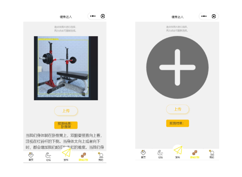
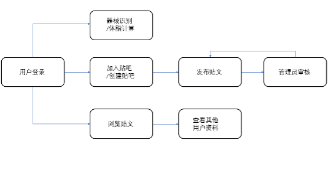
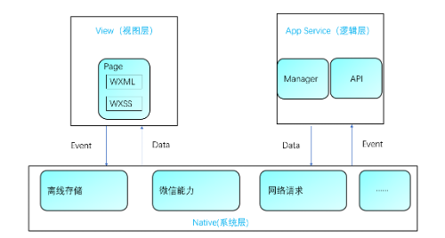
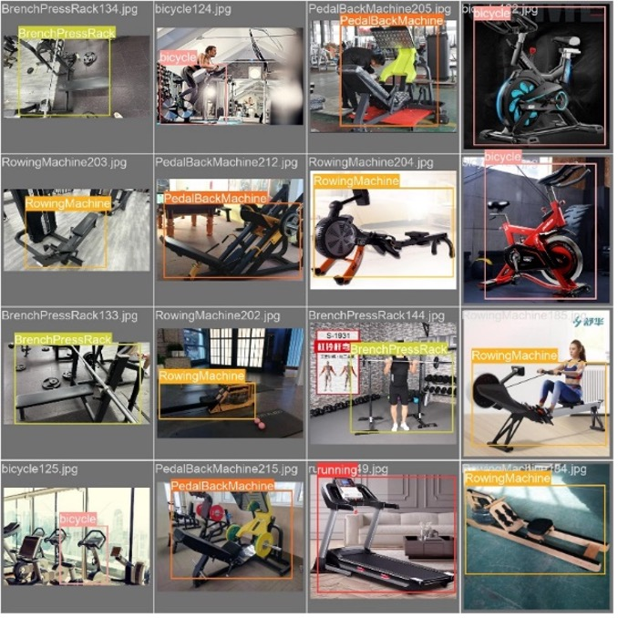
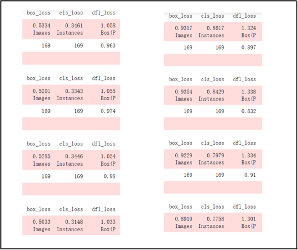
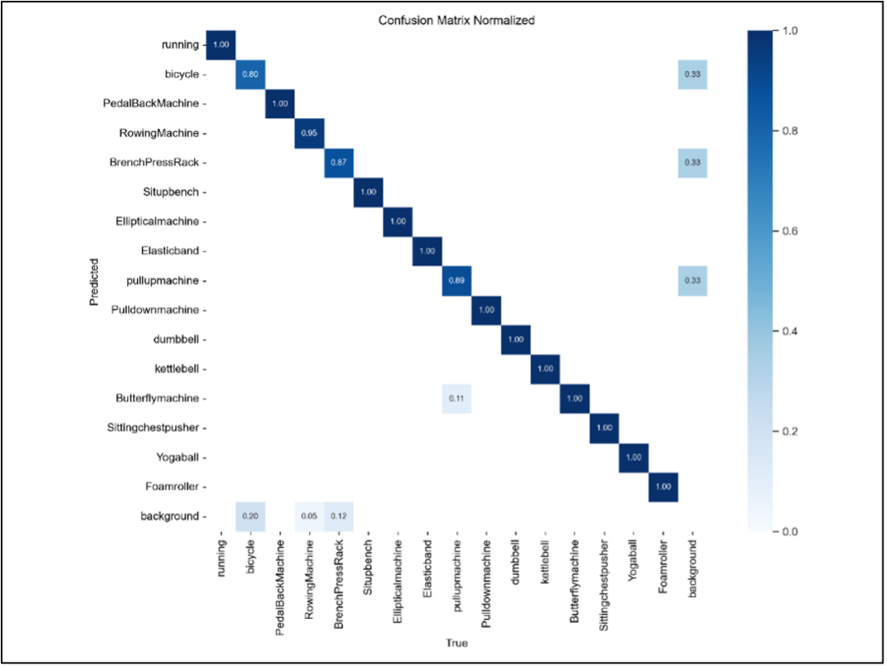
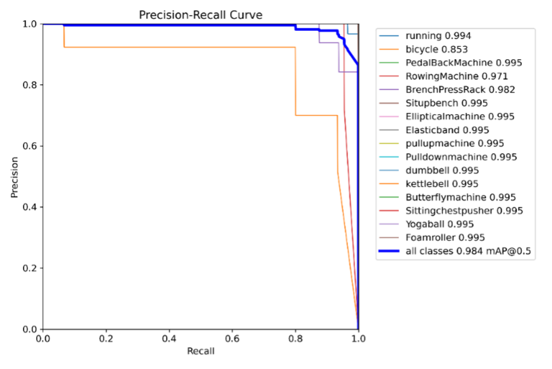

# Fitness Master (健身达人)

Fitness Master was developed to help gym beginners overcome the steep learning curve associated with complex equipment. By integrating Computer Vision into a mobile-first WeChat Mini-program, this platform provides real-time guidance directly within the gym environment.

*Figure 1: Homepage UI and Layout Overview*

Users can identify machines by taking a photo, with the backend using a custom YOLOv8 model to return instant usage instructions and safety tips. To encourage long-term engagement, the system includes a community forum where users can share logs and interact in specialized "Bars".

*Figure 2: AI Equipment Recognition*

*Figure 3: Fitness Master Workflow Diagram*

---

## System Architecture & Tech Stack

The system utilizes a decoupled three-tier architecture consisting of a mobile client, a business logic backend, and an AI inference server.

*Figure 4: MINA Framework Architecture*

The backend is split between two frameworks to optimize performance:
* **ThinkPHP 5**: Handles core BBS features, user authentication via WeChat OpenID, and all CRUD operations for the MySQL database.
* **Flask**: A lightweight Python server deployed specifically to run the YOLOv8 inference.

This isolation ensures that compute-intensive image processing tasks do not bottleneck the responsiveness of the social features. All structured data persists in a centralized MySQL database.

---

## AI Logic: The Engineering Challenge

Developing the recognition engine required a significant focus on data integrity, starting with a collection of 5,000 raw images. After a rigorous manual cleaning process, 3,300 high-quality samples were retained and precisely annotated using Labelme to ensure the model could generalize across various gym environments.

*Figure 5: Visualization of Detection Results*

### Model Architecture & Training
I opted for the YOLOv8 architecture for its sophisticated feature extraction capabilities. The model leverages a C2f structure (Cross Stage Partial Bottleneck) to enhance gradient flow, coupled with an Anchor-Free detection head. Unlike traditional anchor-based models, this approach identifies object centers directly, providing more accurate predictions across varied scales and orientations.

*Figure 6: Training Loss Curves*

After training for 100 epochs, the model’s reliability was confirmed through detailed performance metrics, including confusion matrices and PR curves.

|  |  |
| :--- | :--- |
| *Figure 7: Confusion Matrix* | *Figure 8: PR Curve* |

---

## Database Design

The data persistence layer is built on a highly normalized relational schema with five core tables: Users, Bars, Forums, Posts, and Comments.

* **Hierarchy**: The Forums table acts as the top-level category (e.g., Gym Discussion), maintaining a 1:N relationship with multiple Bars.
* **Relationships**: Each Bar serves as a container for Posts, which are linked via foreign keys to both their parent Bar and the original author.
* **Interaction**: The Comments table enables interactive threading by anchoring responses to specific Post and User IDs.

---

## Health Algorithms

The system accounts for biological differences in energy expenditure by utilizing the Harris-Benedict equation to estimate a user's BMR:

* **Male**: $$BMR = 13.7 \times weight(kg) + 5.0 \times height(cm) - 6.8 \times age + 66$$
* **Female**: $$BMR = 9.6 \times weight(kg) + 1.8 \times height(cm) - 4.7 \times age + 655$$

Building on the Body Mass Index (BMI), the system calculates a refined estimate of the user's body fat percentage to assess overall health status:
$$BodyFat = 1.2 \times BMI + 0.23 \times age - 5.4 - 10.8 \times gender$$

---

## Repository Status
Due to a workstation transition post-graduation, the full source code is currently archived. This repository serves as a Technical Walkthrough and Architectural Overview of the project, demonstrating the integration of SOTA CV models with a full-stack SaaS ecosystem.
